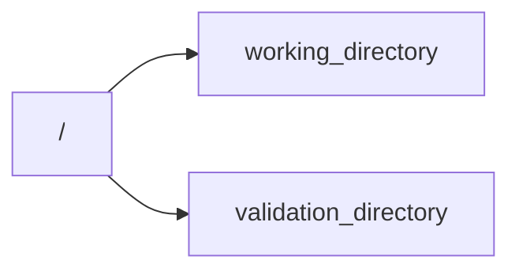

# TEMPLATE PROJECT UJIAN AKHIR SEMESTER MATA KULIAH STRUKTUR DATA

---

### INTRUKSI PENGERJAAN

Anda dimintai untuk menyelesaikan sebuah project dengan template yang dapat di unduh dari repository ini sesuai dengan
branch bahasa yang dipelajari.

---

### STRUKTUR TEMPLATE



- **working_directory** adalah tempat dimana kalian akan menulis kode implementasi dari studi case tetapi tidak merubah
  nama function yang telah disediakan.
- **validation_directory** adalah tempat dimana area yang dilarang untuk di edit atau di otak-atik.

---

### Studi Kasus UAS: Sistem Manajemen Toko Sederhana

Deskripsi: Mahasiswa diminta membuat program "Sistem Manajemen Toko" yang mengintegrasikan berbagai struktur
data (array, list, stack, queue, sort). Program ini harus mampu mengelola data produk, pelanggan, dan transaksi dengan
fitur
utama seperti pencarian, pengurutan, dan simulasi sistem operasional.

### Fitur yang Harus Dibuat

1. Pengelolaan Data Produk
    * Struktur Data: List atau Array
    * Fitur:
        * Tambahkan produk baru (dengan data: nama, ID, stok, harga).
        * Cari produk berdasarkan ID.
        * Tampilkan daftar produk yang diurutkan berdasarkan harga (gunakan metode sorting sederhana, misalnya Bubble
          Sort).
2. Sistem Antrian Pelanggan
    * Struktur Data: Queue
    * Fitur:
        * Tambahkan pelanggan ke antrian.
        * Layani pelanggan satu per satu sesuai urutan (FIFO).
3. Simulasi Transaksi
    * Struktur Data: Stack
    * Fitur:
        * Simpan transaksi yang selesai ke dalam stack (data pelanggan dan produk yang dibeli).
        * Tambahkan fitur Undo (transaksi terakhir dapat dibatalkan dengan pop).
4. Statistik Penjualan
    * Struktur Data: List atau Array
    * Fitur:
        * Hitung jumlah penjualan untuk setiap produk.
        * Tampilkan produk dengan penjualan tertinggi.

### Alur Program

#### Menu Utama:

1. Pengelolaan Produk
    * Tambah produk
    * Cari produk
    * Tampilkan produk (diurutkan berdasarkan harga)
2. Sistem Antrian
    * Tambah pelanggan ke antrian
    * Layani pelanggan
3. Proses Transaksi
    * Simulasi pembelian produk oleh pelanggan
    * Catat transaksi ke dalam stack
    * Batalkan transaksi terakhir (Undo)
4. Statistik Penjualan
    * Tampilkan produk dengan stok paling sedikit
    * Tampilkan produk dengan penjualan tertinggi

##### Simulasi Berlangsung:

1. Setiap fitur harus saling terintegrasi. Contoh: Pelanggan memilih produk → stok berkurang → transaksi dicatat →
   statistik diperbarui.

---

### **Deskripsi Fungsi dalam Code**

Berikut adalah deskripsi masing-masing fungsi dalam kode:

---

#### **1. Global Variables:**

- **`produk_data`**: List yang digunakan untuk menyimpan informasi produk.
- **`antrian_data`**: List untuk menyimpan antrian pelanggan.
- **`transaksi_data`**: List untuk menyimpan data transaksi.
- **`penjualan_data`**: Dictionary untuk menyimpan jumlah penjualan per produk.

---

#### **2. `fitur_pengelolaan_data_produk`:**

Mengelola data produk (penambahan, pencarian, dan pengurutan).

- **`tambah_produk(nama, stok, harga)`**:
    - Fungsi ini dimaksudkan untuk menambahkan produk ke dalam list `produk_data`.
    - Belum diimplementasikan.
- **`cari_produk(nama_produk)`**:
    - Mencari produk berdasarkan nama.
    - Saat ini hanya mengembalikan `produk[0]` tanpa logika pencarian yang benar.
- **`urutkan_produk(sort_berdasarkan)`**:
    - Mengurutkan produk berdasarkan nama, stok, atau harga.
    - Belum diimplementasikan.

---

#### **3. `fitur_sistem_antrian_pelangan`:**

Mengelola antrian pelanggan.

- **`tambah_pelanggan(nama)`**:
    - Menambahkan pelanggan ke dalam antrian.
    - Hanya mengembalikan list `antrian` tanpa benar-benar menambah pelanggan.
- **`layani_pelanggan()`**:
    - Menghapus dan mengembalikan pelanggan pertama dari antrian.
    - Saat ini hanya mengembalikan variabel `pelanggan` tanpa logika yang jelas.

---

#### **4. `fitur_simulasi_transaksi`:**

Mengelola transaksi pelanggan.

- **`simpan_transaksi(nama_pelanggan, nama_produk, jumlah)`**:
    - Menyimpan transaksi pelanggan.
    - Saat ini hanya mengembalikan list `transaksi` tanpa implementasi logika.
- **`undo_transaksi()`**:
    - Membatalkan transaksi terakhir.
    - Saat ini hanya mengembalikan `transaksi[0]` tanpa logika undo yang benar.

---

#### **5. `fitur_laporan_penjualan`:**

Menyediakan laporan terkait penjualan.

- **`update_penjualan(nama_produk, jumlah)`**:
    - Memperbarui jumlah penjualan berdasarkan produk.
    - Belum diimplementasikan.
- **`produk_terlaris()`**:
    - Mengembalikan produk dengan jumlah penjualan tertinggi.
    - Saat ini hanya mengembalikan `penjualan_data[0]`.
- **`stok_kritis()`**:
    - Mengembalikan produk dengan stok terendah (3 teratas).
    - Menggunakan slicing `produk_data[:3]` tanpa logika pengurutan.

---

### **Bagian yang Tidak Perlu Diubah:**

1. **Struktur Menu pada `main()`:**
    - Struktur menu pada fungsi `main()` sudah jelas dan modular.
    - Tidak perlu diubah karena setiap opsi menu sesuai dengan fitur yang disediakan.

2. **Pendekatan Fungsional:**
    - Fungsi-fungsi yang dikelompokkan berdasarkan fitur sudah rapi.
    - Memisahkan logika fitur dari `main()` membantu menjaga kebersihan kode.

---

### **Hal-Hal yang Perlu Diperbaiki sebagai Challenge:**

1. **Implementasi Logika dalam Fungsi:**
    - Banyak fungsi yang belum diimplementasikan atau hanya placeholder. Perbaiki logika untuk:
        - Menambahkan produk (`tambah_produk`).
        - Mengurutkan produk (`urutkan_produk`).
        - Mengelola antrian pelanggan (`tambah_pelanggan`, `layani_pelanggan`).
        - Menyimpan dan membatalkan transaksi (`simpan_transaksi`, `undo_transaksi`).
        - Menghitung produk terlaris dan stok kritis.

2. **Validasi Input:**
    - Tambahkan validasi untuk memastikan input pengguna valid.
    - Misalnya, cek apakah stok dan harga adalah angka positif saat menambahkan produk.

3. **Error Handling:**
    - Tambahkan mekanisme untuk menangani kondisi seperti:
        - Pencarian produk yang tidak ditemukan.
        - Pelanggan yang ingin dilayani tetapi antrian kosong.

4. **Penggunaan Variabel Global:**
    - Hindari penggunaan variabel global (`produk_data`, `antrian_data`, dll.) dalam fungsi.
    - Sebagai alternatif, gunakan parameter atau objek untuk mengelola data.

5. **Optimalisasi Fungsi `stok_kritis`:**
    - Implementasikan logika pengurutan berdasarkan stok sebelum mengambil 3 produk dengan stok terendah.

6. **Pengelolaan Data Penjualan:**
    - Perbaiki fungsi `update_penjualan` agar dapat memperbarui data penjualan dengan benar.

---

### **Flow dari Aplikasi**

#### **1. Menu Utama:**

- **Input:** Pilihan menu 1-5.
- **Output:** Akses ke fitur yang relevan berdasarkan input.

#### **2. Menu Pengelolaan Data Produk:**

- **Opsi:**
    - Tambah produk: Input nama, stok, harga; data disimpan ke `produk_data`.
    - Cari produk: Input nama; hasil pencarian ditampilkan.
    - Urutkan produk: Pilih kriteria pengurutan (nama, stok, harga).
- **Flow:**
    - Tambah produk -> Periksa validasi input -> Simpan ke data global.

#### **3. Menu Sistem Antrian Pelanggan:**

- **Opsi:**
    - Tambah pelanggan: Input nama; pelanggan ditambahkan ke antrian.
    - Layani pelanggan: Pelanggan pertama dilayani (dihapus dari antrian).
- **Flow:**
    - Tambah pelanggan -> Validasi -> Masukkan ke list `antrian_data`.

#### **4. Menu Simulasi Transaksi:**

- **Opsi:**
    - Simpan transaksi: Simpan transaksi pelanggan berdasarkan produk.
    - Undo transaksi: Batalkan transaksi terakhir.
- **Flow:**
    - Simpan transaksi -> Cek produk dan pelanggan -> Perbarui data penjualan.

#### **5. Menu Laporan Penjualan:**

- **Opsi:**
    - Produk terlaris: Menampilkan produk dengan jumlah penjualan tertinggi.
    - Stok kritis: Menampilkan 3 produk dengan stok terendah.
- **Flow:**
    - Hitung produk terlaris -> Ambil dari `penjualan_data`.

#### **6. Keluar:**

- **Flow:** Menampilkan pesan terima kasih dan keluar dari aplikasi.

---

### KRITERIA KELULUSAN

1. minimal menyelesaikan 2 fitur utama.
2. tidak mengubah nama dan parameter function yang telah disediakan. 
3. tidak menyentuh kodingan di directory validation_directory.
4. menyertakan biodata (nama, nim, unit, nama dosen, dan waktu pengerjaan).

---

### PENGECEKKAN

```shell&
python -m unittest discover -s validation_directory
```


